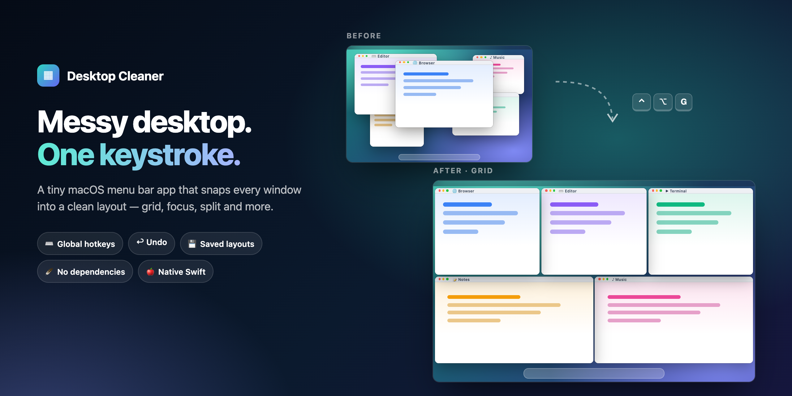
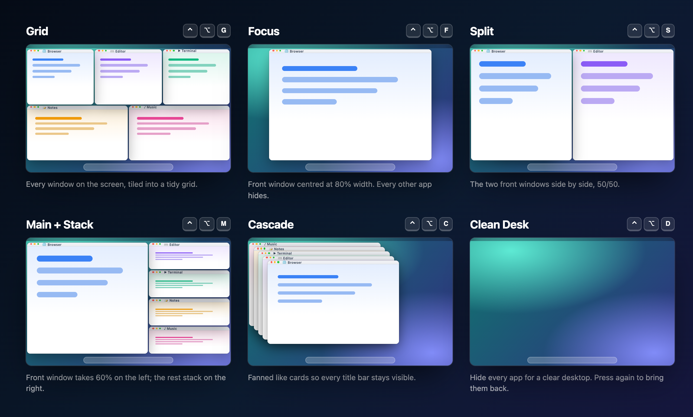
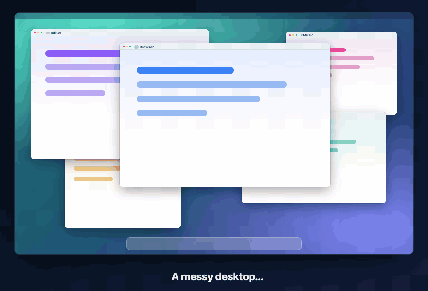

<div align="center">



# Desktop Cleaner

**Messy desktop? One keystroke puts every window in its place.**

A tiny native menu bar app for macOS. Grid, Focus, Split, Main + Stack, Cascade and Clean Desk,<br>
all on global hotkeys, all undoable, with no third-party dependencies.

[](LICENSE)
[](#-quick-start)
[](Package.swift)
[](Package.swift)

[Modes](#-six-ways-to-tidy-up) · [Demo](#-see-it-in-action) · [Features](#-what-you-get) · [Quick start](#-quick-start) · [How it works](#-how-it-works)

</div>

## 🪟 Six ways to tidy up



<sub>The diagrams are drawn from the frames the app's own layout code returns for a sample five-window desktop, so they show exactly where windows land.</sub>

| Hotkey | Mode | What happens |
|---|---|---|
| <kbd>⌃</kbd><kbd>⌥</kbd><kbd>G</kbd> | **Grid** | Every window on the screen is tiled into a near-square grid. A short last row stretches to full width. |
| <kbd>⌃</kbd><kbd>⌥</kbd><kbd>F</kbd> | **Focus** | The front window is centred at 80% width and full height, and every other app hides. |
| <kbd>⌃</kbd><kbd>⌥</kbd><kbd>S</kbd> | **Split** | The two front windows sit side by side, 50/50. Everything else stays put. |
| <kbd>⌃</kbd><kbd>⌥</kbd><kbd>M</kbd> | **Main + Stack** | The front window takes the left 60% and the rest stack on the right. |
| <kbd>⌃</kbd><kbd>⌥</kbd><kbd>C</kbd> | **Cascade** | Windows are fanned like cards so every title bar shows. |
| <kbd>⌃</kbd><kbd>⌥</kbd><kbd>D</kbd> | **Clean Desk** | Every app hides so you're left with a clear desktop. Press it again to bring them back. |
| <kbd>⌃</kbd><kbd>⌥</kbd><kbd>Z</kbd> | **Undo** | Puts windows back where they were before the last arrange. |

## 🎬 See it in action

<div align="center">

</div>

## ✨ What you get

| Feature | What it does |
|---|---|
| ⌨️ **Global hotkeys** | <kbd>⌃</kbd><kbd>⌥</kbd> plus a letter works from any app, and the same shortcuts are listed in the menu. |
| ↩️ **Undo, 20 deep** | A snapshot is taken before every arrange, including any apps that Focus hid. |
| 💾 **Named layouts** | Save where every window sits (e.g. "Coding" or "Meeting") and restore it in one click. Apps that are closed get launched, and hidden ones get unhidden. |
| 🖥️ **Screen-aware** | Arranges only the display under your mouse and keeps clear of the menu bar and Dock. |
| 🙈 **Leaves the right windows alone** | Skips minimised and full-screen windows, panels and popups, tiny windows and anything on another Space. |
| 📏 **Adjustable gap** | Choose 0, 8, 16 or 24 pt between windows. |
| 🚀 **Launch at login** | One toggle in the menu. |
| 🪶 **Small and native** | About 700 lines of Swift with SwiftUI and the Accessibility API. It has no Dock icon and no dependencies. |

## 🤔 Desktop Cleaner or something else?

| Need | Desktop Cleaner | [Rectangle](https://github.com/rxhanson/Rectangle) | Stage Manager (built in) |
|---|---|---|---|
| Arrange **all** windows at once | ✅ Six whole-desktop layouts | Mostly one window at a time | Groups apps into stages |
| Snap one window to a half or corner | ❌ Not yet | ✅ Many positions, plus drag to snap | ❌ |
| Save and restore named layouts | ✅ | ❌ | ❌ |
| Install | Build from source | Download or Homebrew | Nothing to install |
| Maturity | Early (v0.1) | Mature, widely used | Part of macOS |

If you mostly move **one** window at a time, Rectangle is excellent. Desktop Cleaner is for the moment your whole screen is chaos and you want it sorted in one go.

## 🚀 Quick start

**Requirements:** macOS 14 Sonoma or later and a Swift 6 toolchain. Xcode's Command Line Tools are enough (`xcode-select --install`), so you don't need the full Xcode.

```bash
git clone https://github.com/tlejay/desktop-maid.git
cd desktop-maid
./scripts/install.sh      # builds, installs to ~/Applications and launches
```

On first launch, macOS asks for **Accessibility** permission. Enable *Desktop Cleaner* under **System Settings → Privacy & Security → Accessibility**. That's the only permission it needs.

### Keep the permission across rebuilds (optional)

macOS ties the Accessibility grant to the app's code signature. An ad-hoc signed build gets a new signature every time, so you'd have to re-grant after each rebuild. You can create a stable self-signed identity once, and `build-app.sh` will pick it up automatically:

```bash
cat > /tmp/dc.cnf <<'CNF'
[req]
distinguished_name = dn
x509_extensions = ext
prompt = no
[dn]
CN = Desktop Cleaner Dev
[ext]
keyUsage = critical,digitalSignature
extendedKeyUsage = critical,codeSigning
CNF
/usr/bin/openssl req -x509 -newkey rsa:2048 -nodes -keyout /tmp/dc.key -out /tmp/dc.pem -days 3650 -config /tmp/dc.cnf
/usr/bin/openssl pkcs12 -export -inkey /tmp/dc.key -in /tmp/dc.pem -out /tmp/dc.p12 -passout pass:dc
security import /tmp/dc.p12 -k ~/Library/Keychains/login.keychain-db -P dc -T /usr/bin/codesign
rm /tmp/dc.key /tmp/dc.p12
```

### Scripts

| Command | What it does |
|---|---|
| `./scripts/install.sh` | Builds, copies to `~/Applications/Desktop Cleaner.app` and launches it |
| `./scripts/run.sh` | Builds and runs straight from `build/` (for development) |
| `./scripts/check.sh` | Checks the layout math for every mode (in bounds, no overlaps) |
| `swift build` | Quick compile check |

## 🔧 How it works

```
hotkey / menu ──▶ Arranger ──▶ WindowCollector ──▶ LayoutMode.arrange() ──▶ WindowMover
                     │         (AX + CGWindowList)    (pure math, no I/O)     (AX set size/position)
                     └─ snapshot for Undo
```

- **Modes are pure functions.** `arrange(windows:in:gap:) -> [WindowID: CGRect]` takes windows front to back plus the usable screen area and returns target frames. They never touch the system, so `Checks/` can verify them without opening a single window.
- **Window discovery** uses the Accessibility API to read each app's standard windows, and `CGWindowListCopyWindowInfo` for stacking order and current-Space filtering.
- **Coordinates** go through one converter (`ScreenGeometry.toAX`) because AppKit measures from the bottom left while Accessibility measures from the top left.
- **Moving a window** means setting its size, then its position, then its size again, because the first resize can get clamped at a screen edge.
- **Named layouts** are stored as JSON in `UserDefaults` and match windows by bundle ID and then by title.

### Adding a mode

1. Create `Sources/DesktopCleaner/Modes/YourMode.swift` that conforms to `LayoutMode`.
2. Add it to `LayoutModes.all`, and optionally give it a hotkey in `Shortcuts.all`.
3. Add a check in `Checks/main.swift` and run `./scripts/check.sh`.

### Project layout

```
Sources/DesktopCleaner/
├── App/       @main, AppDelegate (hotkey registration)
├── Core/      Accessibility helpers, ScreenGeometry, WindowCollector, WindowMover,
│              Arranger (undo + clean desk), LayoutStore (named layouts)
├── Modes/     LayoutMode protocol, slicing helpers, one file per mode
├── Hotkeys/   Shortcut table + Carbon hotkey registration
└── UI/        Menu bar menu, name prompt
Checks/        Layout-math checks (run via scripts/check.sh)
scripts/       build-app.sh · install.sh · run.sh · check.sh
```

## ⚠️ Known limitations

- Some apps enforce a minimum window size, so in dense layouts their windows can overlap a little.
- Layouts apply to the display under the mouse. Moving windows between displays isn't supported yet.
- ⌃⌥ + letter may clash with shortcuts in other apps. For now, change them in `Shortcuts.all`.
- It uses the private `_AXUIElementGetWindow` call, like most window managers, so it can't go on the Mac App Store. That's fine for this app.

## 🤝 Contributing

Issues and PRs are welcome, especially new modes. Please keep the rule that modes are pure math, and run `./scripts/check.sh` before opening a PR.

## 📄 License

[MIT](LICENSE)

<div align="center">
<br>
If Desktop Cleaner tidied up your day, a ⭐ helps other people find it.
</div>
